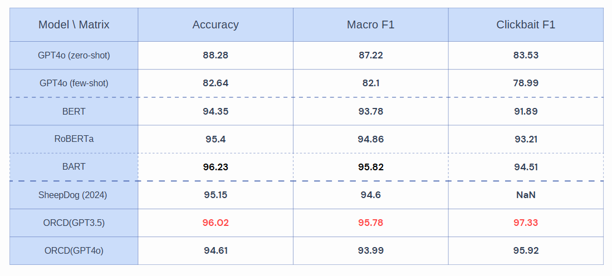
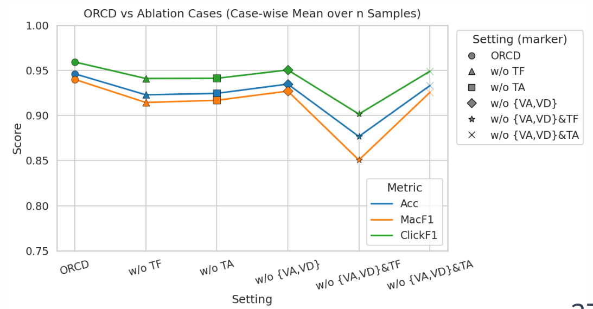

# Comprehensive Fake News & Clickbait Detection Suite

This repository provides a complete suite of tools, experiments, and models dedicated to the study, detection, and mitigation of Clickbait and Fake News generated by varying textual styles and LLM capabilities. 

Combining research-grade detectors with practical real-time inference tools, the repository tackles the problem from both structural and stylistic perspectives, proving robust detection against advanced LLM-empowered style attacks.

## 🌟 Key Features

The workspace is structured into several isolated but conceptually linked sub-projects:

### 1. **SheepDog: Robust Fake News Detection** (`/SheepDog/`)
An advanced, style-agnostic fake news detector built to withstand LLM-empowered style varying attacks.
* Implements the **KDD '24** paper *Fake News in Sheep's Clothing: Robust Fake News Detection Against LLM-Empowered Style Attacks*.
* Prioritizes content-centric veracity attributions over style, ensuring resilience against varied stylistic reframings by Large Language Models.
* Features training pipelines, style-agnostic tuning, and evaluation scripts across major datasets.

### 2. **BERT & Transformer Fine-Tuning** (`/Bert_Fami/`)
Contains fine-tuned transformer model implementations on Clickbait datasets.
* Includes diverse checkpoints for heavily researched models such as `roberta-large`, `bart-large-mnli`, `bert-large-cased`, and `distilroberta`.
* Dedicated training (`train_bert.py`) and evaluation architectures.

### 3. **Observational & Reasoning Clickbait Detectors** (`/ORCD/`)
Ablation studies, dataset management, and student-teacher distillation modules.
* **GPT-3.5 & GPT-4o-mini pipelines**: Automated scripts used for generating reasoning-based detections.
* **Wo_GPT**: Knowledge distillation from LLMs down to smaller transformer-based variants (e.g., student RoBERTa networks).

### 4. **Prompt-Based Inference (Zero/Few Shot)** (`/GPT-Shot/`)
Experimentation suite focusing on the raw zero-shot and few-shot capabilities of LLMs contextually reasoning about clickbait and misinformation.
* Generates continuous metrics over extensive API calls (`ChatGPT.py`).

### 5. **Realtime Detection GUI & Extension** (`/GUI/`)
A practical application layer showcasing the models' functionality.
* **FastAPI Backend**: Serves predictions to client apps by routing inputs through the various specialized detectors available in the suite.
* **Chrome Extension**: A real-time hover-to-evaluate tool providing probabilities and trustworthiness scores for news headlines on any website.

## 🛠️ Installation & Setup

We recommend setting up a virtual environment (e.g., `venv` or `conda`):

```bash
# 1. Clone the repository
git clone https://github.com/your-username/fake-news-detection-suite.git
cd fake-news-detection-suite

# 2. Create and activate a Virtual Environment
python -m venv .venv
source .venv/bin/activate  # On Linux/Mac
# .\venv\Scripts\Activate.ps1 # On Windows

# 3. Install the unified dependencies
pip install -r requirements.txt
```

## 🚀 Usage

### Training Models (e.g., SheepDog)
```bash
cd SheepDog
bash train_optimized.sh
```

### Running the Inference Backend (GUI/API Server)
```bash
cd GUI/application/backend
uvicorn main:app --reload --host 0.0.0.0 --port 8000
```
> Ensure that model weights are placed securely inside their corresponding component folders (`Bert_Fami/weights`, `ORCD/.../weight`, etc.) prior to inference.

## � Performance Results

Below are the evaluation metrics and ablation study results showcasing the performance and robustness of our models against style attacks:

**Overall Metrics & Performance:**


**Ablation Studies:**


## �📚 Acknowledgments & References

* *Fake News in Sheep's Clothing: Robust Fake News Detection Against LLM-Empowered Style Attacks* (KDD 2024), Jiaying Wu, Jiafeng Guo, Bryan Hooi.

---
*Built with ❤️ for robust, responsible NLP and trustworthy media architectures.*
